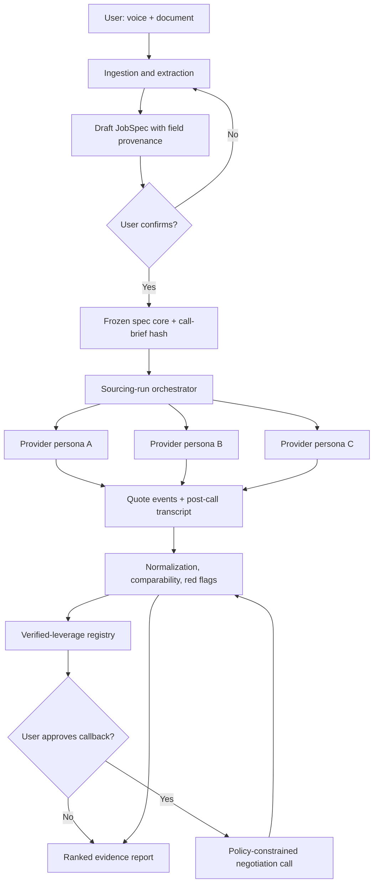
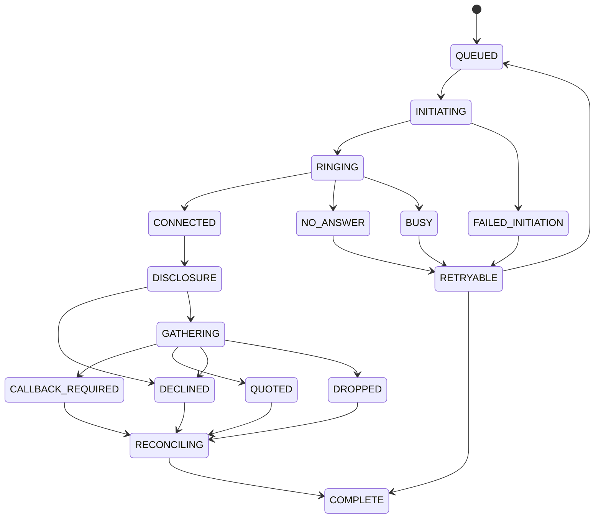

# The Negotiator: Build-Ready Architecture and Engineering Playbook

Hack-Nation × ElevenLabs · Technical architecture · July 18, 2026

## Technical summary

Build **auto-glass replacement for a known VIN** as the hackathon vertical. Use **junk removal as the ready fallback and second configuration**; keep **corporate catering on the roadmap only**. The final three-way research scores auto glass 88.6, junk removal 77.0, and catering 48.6. Auto glass wins because the VIN makes quotes genuinely comparable, ADAS recalibration creates a visible hidden-fee story, price matching is a credible negotiation mechanism, and the same written quote can serve as document intake and verified leverage. [S1, lines 39–61; S4, lines 54–93]

The MVP is one closed, evidence-backed loop:

1. A user supplies a VIN photo or written quote and completes a short ElevenLabs voice interview.
2. Both inputs populate one canonical `JobSpec`; the user confirms it, after which its call-facing core is immutable.
3. One buyer-side ElevenLabs caller contacts three live counterparty agents with distinct private cost models and behavior.
4. Each call ends as an itemized quote, callback commitment, or documented decline.
5. A deterministic policy engine releases only verified, provenance-backed leverage.
6. The buyer agent re-calls one provider, asks for a price match or fee concession, and records the measurable change.
7. The UI ranks comparable offers and lets a judge click any price to the transcript/audio moment that supports it.

The architecture should be **policy-heavy and model-light**. LLMs handle conversation, extraction proposals, and plain-language explanations. Deterministic code owns spec immutability, arithmetic, comparability, leverage authorization, red flags, ranking, state transitions, and every action that could bind the user. This follows the research warning that unconstrained LLM negotiators may over-concede and that the hard problem is spec integrity rather than telephony. [S3, lines 84–94 and 164–188; S5, lines 119–144]

The safest demo uses live agent-to-agent calls over dedicated Twilio numbers. Real businesses are for a small, manual validation sprint and optional pre-recorded evidence—not the critical live path. The official challenge brief itself is not among the supplied files, so the team must verify the final rules before submission; the source documents sometimes treat their reconstruction of the brief as authoritative. [S3, lines 31–78; S5, lines 27–35 and 202–210]

## 1. Decisions to lock now

| Decision | Lock | Why |
|---|---|---|
| Primary vertical | Auto glass: cash-pay windshield replacement for one known VIN | Best comparability, authentic price-match lever, memorable hidden fee, high differentiation. [S1, lines 43–59] |
| Fallback | Photographed one-bedroom junk-removal job | Lower domain and execution risk; document intake is exceptionally natural. [S2, lines 59–93] |
| Roadmap-only vertical | Recurring corporate catering | Strong business economics but weak phone necessity, comparability, and one-call completion. [S1, lines 19–35] |
| Demonstration market | Three live counterparty agents with private cost/concession models | Reliable, legal-risk-minimized, and exposes real decision rules rather than a scripted discount. [S3, lines 179–188 and 203–220] |
| Real-provider usage | Five manual validation calls before the event; no dependency in the live demo | Produces authentic ranges/dialogue and a go/no-go gate without making the presentation fragile. [S1, lines 69–78] |
| Binding authority | None | The agent may request and negotiate quotes, but cannot book, pay, accept, or promise. |
| Memory | Structured state and append-only evidence; no free-form “agent memory” as authority | Prevents stale or fabricated facts from entering calls. |
| Core stack | TypeScript monorepo, Next.js web/API, PostgreSQL, Redis queue, S3-compatible storage | Fast to build, auditable, and enough for the closed loop. |
| Vector database | Excluded from MVP | No retrieval problem justifies it. The consolidation explicitly warns against this overengineering. [S3, lines 164–175] |
| Call scheduling | Sequential by default | Simplifies judging, rate limits, state, audio monitoring, and compliance. Parallelism can be a post-demo feature. |

### Go/no-go gate for auto glass

Before implementation is allowed to depend on auto glass, confirm:

- A real or safe demo VIN is available.
- Five manual calls produce at least three usable quotes.
- Every observed fee maps to the proposed taxonomy.
- At least one shop says it will consider a verified competing quote or change a term.
- The team can correctly explain OEM versus aftermarket glass, static versus dynamic ADAS calibration, mobile versus in-shop service, moldings/clips, disposal, warranty, and safe-drive-away time.

If these fail, switch only the vertical configuration, demo media, and personas to junk removal. Do not redesign the engine. [S1, lines 69–78; S2, lines 83–93]

## 2. Exact MVP scope

### In scope

- One authenticated demo user and one project.
- One vehicle/VIN and one cash-pay windshield-replacement request.
- Voice intake through an ElevenLabs agent.
- Document intake from a VIN photo, registration/insurance card, or competitor quote.
- One confirmed, versioned canonical spec and one immutable call brief.
- Three provider personas with different behavior, economics, and failure modes.
- Three quote-collection calls and one negotiation callback.
- Structured line items, exclusions, totals, terms, confidence, and transcript/audio provenance.
- Verified-leverage enforcement, red flags, deterministic ranking, and a recommendation.
- A live evidence UI and a pre-recorded fallback for every call segment.
- Auto-glass configuration plus a junk-removal configuration shown side by side.

### Explicitly out of scope

- Autonomous booking, deposits, payments, signatures, or calendar commitments.
- Insurance-claim submission, coverage advice, or communication as the insured.
- High-volume or batch calling.
- Scraping a full provider marketplace.
- Production-grade consumer onboarding, billing, CRM, fleet integrations, or multi-tenant administration.
- Learning provider behavior from historical calls.
- A generic negotiation planner or multi-agent “company.”
- Supporting more than two vertical configurations during the hackathon.
- Any ranking that treats missing fees as zero.

### Definition of done

One uninterrupted run shows document plus voice intake, confirmed spec, three live calls with distinct behaviors and structured endings, one measurable improvement caused by verified leverage, a transcript-cited ranking, an AI/recording disclosure moment, and the second-vertical configuration. This is the source set’s shared definition of done. [S1, lines 120–126; S3, lines 224–237]

## 3. User journeys and end-to-end flows

### 3.1 Happy-path user journey

1. **Create project.** User chooses “Windshield replacement” and accepts the AI/recording/data notice for their intake conversation.
2. **Upload evidence.** User uploads a VIN photo or a written quote. The UI immediately shows extraction status and warns that extracted fields are drafts.
3. **Voice clarification.** Intake agent asks only unresolved or decision-relevant questions: cash-pay or insurance, damage type, service ZIP, service location preference, date windows, OEM requirement, known camera/sensor features, and whether the rival quote may be used as leverage.
4. **Review and confirm.** UI shows every canonical field, its source, confidence, and unresolved values. The user edits or confirms.
5. **Freeze.** Backend writes `spec_revision`, generates a canonical call brief, hashes both, and changes status to `CONFIRMED`. Calls can reference only this revision.
6. **Select providers.** Demo uses three configured personas; real mode would use a user-approved shortlist sourced from a directory.
7. **Collect.** Orchestrator calls providers sequentially. The dashboard streams call state, transcript snippets, tool events, detected line items, and unresolved fee questions.
8. **Normalize.** Backend reconciles tool events with the post-call transcript, computes all-in totals, checks scope equivalence, and marks missing information as `UNKNOWN`.
9. **Authorize leverage.** Policy engine converts a fully verified competing offer into a narrow `LeverageFact` with an exact allowed claim.
10. **Negotiate.** User approves the callback. Buyer agent requests a match or specific fee concession, using the allowed claim and permitted user tradeoffs.
11. **Recommend.** UI ranks eligible offers, explains exclusions and flags, and shows original-to-revised price movement.
12. **Stop before commitment.** User may copy the quote or request written confirmation. Booking remains outside the MVP.

### 3.2 System flow



### 3.3 Call lifecycle



Every terminal state must carry a structured reason. “Call ended” is not an outcome.

## 4. Product and codebase structure

### 4.1 Monorepo

```text
apps/
  web/                 Next.js UI and authenticated route handlers
  worker/              Queue consumers and long-running orchestration
packages/
  domain/              Zod schemas, state machines, money/provenance types
  verticals/
    auto-glass/        job spec, fee map, prompts, levers, red flags, benchmarks
    junk-removal/      second config proving portability
  policy/              comparability, leverage, concessions, ranking, approvals
  elevenlabs/          API client, webhook verification, event adapters
  ingestion/           OCR/vision adapters, VIN validation, document parsing
  simulation/          provider private models and deterministic seeds
  evals/               fixtures, golden transcripts, graders, replay harness
infra/
  migrations/          PostgreSQL migrations
  docker/              local Postgres and Redis
  deploy/              environment templates and runbooks
```

### 4.2 Frontend surfaces

| Route | Purpose | Must show |
|---|---|---|
| `/projects/new` | Choose vertical and create project | Demo/simulation badge, consent notice |
| `/projects/:id/intake` | Upload and voice interview | Upload state, live transcript, unresolved fields |
| `/projects/:id/spec` | Review and confirm | Field value, provenance, confidence, edit, unknowns, hash after confirmation |
| `/projects/:id/calls` | Run and monitor calls | Provider, state, elapsed time, live transcript, tool events, retry/cancel |
| `/projects/:id/compare` | Compare normalized offers | Scope differences, all-in totals, missing fees, red flags, quote validity |
| `/projects/:id/negotiate` | Approve and observe callback | Allowed leverage, requested concession, original/revised offer, policy log |
| `/projects/:id/report` | Final recommendation | Ranking, reasons, evidence player, downloadable audit JSON |
| `/demo/control` | Operator-only safety panel | Mode switch, persona seed, pre-recorded fallback, reset run |

Frontend rules:

- Never display a number without its status: `VERIFIED`, `DERIVED`, `ESTIMATED`, or `UNVERIFIED`.
- Never collapse `excluded`, `not_applicable`, and `unknown` into one state.
- Keep original and negotiated offer versions visible.
- Put a persistent **SIMULATED PROVIDERS** banner in simulation mode.
- Show the confirmed call brief side by side with each call to prove consistency.
- Require explicit approval before a real call or negotiation callback.

### 4.3 Backend modules

| Module | Responsibility |
|---|---|
| Auth/API | Sessions, authorization, request validation, idempotency |
| Upload service | Presigned upload, MIME validation, scanning, metadata stripping |
| Extraction service | OCR/vision proposals and field-level evidence |
| Spec service | Draft/edit/confirm/version/hash; rejects mutation after confirmation |
| Call orchestrator | Provider sequence, retry policy, rate limit, lifecycle transitions |
| ElevenLabs adapter | Start calls, pass dynamic variables, verify and ingest webhooks |
| Quote reconciler | Merge live tool events and post-call extraction |
| Normalizer | Fee mapping, arithmetic, comparability, red flags |
| Policy engine | Verified facts, allowed leverage, concession ladder, approval gates |
| Ranking service | Eligibility, deterministic scoring, explanation input |
| Evidence service | Transcript anchors, audio clip ranges, signed playback URLs |
| Report service | Recommendation, audit export, demo snapshots |

## 5. ElevenLabs agent orchestration

ElevenLabs currently exposes a single-call Twilio endpoint at `POST /v1/convai/twilio/outbound-call`; it accepts an agent, an ElevenLabs phone-number ID, destination number, initiation data, and recording configuration, and returns the conversation ID and Twilio call SID. Use this endpoint for individual approved calls, not batch calling. [ElevenLabs outbound-call API](https://elevenlabs.io/docs/api-reference/twilio/outbound-call/)

### 5.1 Agent inventory

| Agent | Count | Channel | Authority |
|---|---:|---|---|
| Intake agent | 1 | Web real-time voice | Ask, clarify, propose spec fields; cannot confirm for user |
| Buyer caller/negotiator | 1 | Outbound Twilio | Present frozen brief, collect quote, request policy-approved concessions |
| Counterparty agents | 3–4 | Inbound Twilio | Simulate provider economics and behavior; private configuration |
| Explanation model | 1 logical service | Backend text | Explain deterministic ranking; cannot alter facts or scores |

Do not create separate “researcher,” “memory,” “critic,” “manager,” or “closer” agents. They add failure boundaries without improving the judged loop. [S3, lines 179–190]

### 5.2 Runtime inputs to the buyer agent

Pass only narrow dynamic variables:

- `project_id`
- `sourcing_run_id`
- `call_id`
- `provider_id`
- `vertical_id`
- `spec_revision`
- `call_brief_text`
- `call_brief_sha256`
- `allowed_concessions`
- `phase` = `QUOTE_COLLECTION` or `NEGOTIATION`

For negotiation, do **not** inject a bag of raw competitor quotes. The caller must request an allowed leverage statement from the backend. ElevenLabs dynamic variables can populate prompts and tool parameters; sensitive headers should use secret/environment variables rather than prompt-visible values. [ElevenLabs dynamic variables](https://elevenlabs.io/docs/eleven-agents/customization/personalization/dynamic-variables) and [environment variables](https://elevenlabs.io/docs/eleven-agents/integrate/environment-variables)

### 5.3 Buyer-agent tools

Expose narrowly scoped webhook tools:

| Tool | Input | Backend rule | Result |
|---|---|---|---|
| `get_call_brief` | `call_id` | Call must reference confirmed spec revision | Exact frozen brief and hash |
| `log_quote_item` | category, raw label, amount, included status, transcript hint | Valid category or `OTHER`; never overwrites | Append candidate line item |
| `log_quote_total` | amount, tax status, scope status | Money validation | Append offer version |
| `log_term` | term type and value | Whitelist term types | Append term evidence |
| `mark_unknown` | field and provider response | Field must be required/optional in config | Preserve unknown, never zero |
| `request_leverage` | provider, desired concession | Policy evaluates verified facts and approval | Exact allowed statement or denial |
| `record_counteroffer` | changed items/total | Arithmetic and provenance validation | New immutable offer version |
| `close_call` | outcome and reason | Required fields vary by outcome | Terminal `CallOutcome` |

ElevenLabs supports webhook tools that call external APIs; tool descriptions and prompts should specify sequencing and error handling. [ElevenLabs webhook tools](https://elevenlabs.io/docs/eleven-agents/customization/tools/webhook-tools)

Never expose `write_database`, `book_service`, `send_payment`, arbitrary HTTP, or generic calendar tools.

### 5.4 Counterparty personas

Each persona has public behavior plus a private economic model unavailable to the buyer:

```yaml
persona_id: premium_chain
style: polite_firm
private:
  cost_floor_minor: 56000
  target_total_minor: 84000
  line_items:
    glass: 36000
    adas_calibration: 36000
    mobile_service: 8000
    disposal: 2500
    tax: 7500
  concessions:
    - trigger: verified_competitor_within_10_percent
      action: waive_mobile_service
    - trigger: in_shop_and_off_peak
      action: discount_minor_5000
  refusal_conditions:
    - requested_total_below_cost_floor
public:
  starts_itemized: true
  interrupts: false
  asks_if_ai: true
```

Recommended set:

1. **Premium chain:** itemizes clearly, defends warranty, asks whether caller is AI, and will match within a bounded range after verified evidence.
2. **Independent lowballer:** cheap headline, omits calibration until challenged, interrupts, and becomes non-comparable if it refuses scope parity.
3. **Rushed mobile operator:** gives a range, pushes a callback, charges mobile fee, and needs a valid scheduling concession.
4. **Optional refusal persona:** declines AI or recording and demonstrates a structured decline.

Randomness may change phrasing, but price movement must be caused only by logged triggers. Reveal the private models after the demo to prove the negotiation was not a screenplay. [S1, lines 73–89; S3, lines 183–188]

### 5.5 Real-time conversation handling

ElevenLabs exposes real-time events for audio, transcripts, agent responses, tool calls, interruptions, and latency signals over WebSockets. [ElevenLabs events](https://elevenlabs.io/docs/eleven-agents/customization/events) and [Agent WebSocket API](https://elevenlabs.io/docs/eleven-agents/api-reference/eleven-agents/websocket)

Configure and rehearse:

- **Opening:** identity, customer representation, purpose, and recording notice in two short sentences.
- **Interruption:** enabled for ordinary conversation; disabled while delivering legally required disclosure if the platform configuration permits it.
- **Turn eagerness:** conservative enough not to cut off dollar amounts and VIN characters.
- **Soft timeout:** short neutral filler; never promise a time estimate.
- **Number confirmation:** repeat every total and high-impact fee once.
- **Long answers:** summarize and ask one confirmation question.
- **Tool latency:** target under 800 ms; fail closed if leverage or spec tools time out.
- **Silence:** one re-prompt, then offer callback/close.
- **Voicemail/IVR:** do not leave negotiation details; mark `AUTOMATION_OR_VOICEMAIL` and retry only under policy.
- **Transfer:** accept only if the new party understands the disclosure; retain one call ID and create a segment boundary.
- **Dropped call:** preserve partial evidence but never label it a complete quote.

ElevenLabs’ conversation-flow controls cover silence, soft timeouts, interruptions, and turn eagerness. [Conversation-flow documentation](https://elevenlabs.io/docs/eleven-agents/customization/conversation-flow)

### 5.6 Post-call processing

Subscribe to:

- `post_call_transcription`
- `post_call_audio` when explicit consent and retention policy allow it
- `call_initiation_failure`

Verify the `ElevenLabs-Signature` HMAC against the raw request body, reject stale/invalid signatures, return `200` quickly, and enqueue processing. Treat payloads as extensible and ignore unknown fields. Current webhooks include conversation/agent/version metadata, transcripts, analysis, initiation data, and timing; audio arrives separately. [ElevenLabs post-call webhooks](https://elevenlabs.io/docs/eleven-agents/workflows/post-call-webhooks)

Processing order:

1. Deduplicate on event type plus conversation ID plus payload hash.
2. Persist raw encrypted event in restricted object storage.
3. Upsert call/conversation metadata.
4. Split transcript into immutable turns.
5. Reconcile mid-call tool records against transcript evidence.
6. Run quote extraction as a proposal, never a silent overwrite.
7. Normalize, compute, and compare.
8. Generate evidence anchors and optional audio clips.
9. Advance sourcing-run state.

## 6. Canonical job specification

### 6.1 The key design: immutable core, separate provenance

Voice and document inputs should emit the **same schema and semantically identical confirmed core**, not literally byte-identical full JSON. Provenance, upload IDs, timestamps, and confidence will naturally differ. Freeze and hash `spec.core` plus the generated call brief; store evidence metadata outside the hash. This preserves the source documents’ “single spec reused verbatim” goal without pretending two ingestion histories are identical. [S3, lines 33–44 and 134–145; S5, lines 121–136]

### 6.2 Schema

```json
{
  "schemaVersion": "1.0",
  "specId": "spec_123",
  "revision": 3,
  "vertical": "auto_glass",
  "status": "CONFIRMED",
  "core": {
    "purchaseMode": "CASH_PAY",
    "vehicle": {
      "vin": "2T3...",
      "vinVerification": "CHECKSUM_AND_DECODED",
      "year": 2021,
      "make": "Toyota",
      "model": "RAV4",
      "trim": "UNKNOWN",
      "adasFeatures": ["FRONT_CAMERA"],
      "rainSensor": "UNKNOWN",
      "heatedGlass": "UNKNOWN"
    },
    "damage": {
      "service": "WINDSHIELD_REPLACEMENT",
      "location": "FRONT",
      "drivable": true
    },
    "requirements": {
      "glassPreference": "AFTERMARKET_EQUIVALENT_ACCEPTABLE",
      "calibrationRequired": "YES",
      "serviceMode": ["MOBILE", "IN_SHOP"],
      "warrantyRequired": true
    },
    "serviceArea": {
      "postalCode": "10001",
      "exactAddressDisclosure": "AFTER_SELECTION"
    },
    "schedule": {
      "windows": ["2026-07-20_AM", "2026-07-21_PM"],
      "flexible": true
    },
    "authorization": {
      "mayGatherQuotes": true,
      "mayUseVerifiedCompetitorOffer": true,
      "mayBook": false,
      "maximumTotalMinor": null
    },
    "unknowns": ["vehicle.trim", "vehicle.rainSensor"]
  },
  "callBrief": {
    "text": "I am requesting a cash-pay quote for ...",
    "sha256": "..."
  },
  "confirmation": {
    "confirmedBy": "user_123",
    "confirmedAt": "2026-07-18T21:00:00Z",
    "coreSha256": "..."
  }
}
```

### 6.3 Field provenance

Every field proposal has:

```json
{
  "jsonPointer": "/core/vehicle/vin",
  "value": "2T3...",
  "sourceType": "IMAGE_OCR",
  "sourceId": "upload_123",
  "locator": { "page": 1, "box": [0.12, 0.34, 0.72, 0.43] },
  "confidence": 0.98,
  "verification": "USER_CONFIRMED",
  "createdBy": "vin_ocr_v1"
}
```

Rules:

- Draft extraction may add candidates, never confirmed facts.
- Conflicting candidates require user resolution.
- A VIN must be normalized to 17 characters, pass format/checksum validation when applicable, and preferably decode consistently.
- `UNKNOWN` is an explicit value, not a blank or guessed default.
- A confirmed revision cannot be edited. Changes create a new revision and invalidate unstarted calls; completed calls remain tied to the old revision.
- The call brief is generated once and reused exactly. Provider-specific greetings may vary, but the job description may not.

## 7. Voice, photo, and document ingestion

### 7.1 Upload pipeline

1. Client requests a presigned upload URL.
2. Upload lands in a private quarantine prefix.
3. Worker validates MIME magic bytes, size, extension, and malware scan result.
4. Image worker strips EXIF/GPS and creates a display derivative.
5. Classifier labels `VIN_PHOTO`, `REGISTRATION`, `INSURANCE_CARD`, `COMPETITOR_QUOTE`, or `UNSUPPORTED`.
6. Specialized extractor proposes fields and evidence coordinates.
7. Deterministic validators normalize VIN, currency, dates, phone numbers, and postal code.
8. User resolves low-confidence or conflicting fields.
9. Original object receives retention policy; derivative and extracted text receive separate access controls.

### 7.2 Voice intake

The intake agent retrieves the current draft, asks only required missing questions, and calls `propose_spec_field`. It must not ask for data already verified from the document unless confirmation is safety-critical. At the end it summarizes the full spec in plain language, but the UI—not the voice agent—owns final confirmation.

### 7.3 Competitor quote parsing

Parse these independently:

- Provider identity and quote date.
- VIN/vehicle match.
- Glass part/type/brand and OEM status.
- Base glass and labor.
- Calibration inclusion, type, and price.
- Mobile/in-shop service.
- Moldings/clips/urethane/disposal.
- Tax and all-in total.
- Warranty, validity, appointment availability, and written-confirmation status.

If the document total conflicts with the line-item sum, preserve both, show the variance, and mark the offer for confirmation.

### 7.4 Ingestion failure modes

- Blurry VIN: ask for manual entry or another image.
- Multiple VINs: block confirmation until one is selected.
- Quote for wrong vehicle: retain as evidence but prohibit it as leverage.
- Screenshot without provider/date: `UNVERIFIED_DOCUMENT`.
- Handwritten amount: low confidence and mandatory user confirmation.
- PDF with prompt-like instructions: treat content as data; never allow it to alter system/tool behavior.
- Unsupported file: store only if necessary, otherwise reject with a clear reason.

## 8. Quote schema, normalization, and provenance

### 8.1 Offer model

```json
{
  "quoteId": "quote_123",
  "providerId": "provider_A",
  "callId": "call_123",
  "specRevision": 3,
  "offerVersion": 2,
  "stage": "NEGOTIATED",
  "currency": "USD",
  "lineItems": [
    {
      "category": "BASE_GLASS_AND_INSTALL",
      "rawLabel": "windshield installed",
      "amountMinor": 36000,
      "status": "INCLUDED",
      "scope": { "glassType": "AFTERMARKET_EQUIVALENT" },
      "provenanceIds": ["prov_1"]
    },
    {
      "category": "ADAS_CALIBRATION",
      "amountMinor": 30000,
      "status": "INCLUDED",
      "scope": { "calibrationType": "DYNAMIC" },
      "provenanceIds": ["prov_2"]
    }
  ],
  "totals": {
    "statedAllInMinor": 66000,
    "computedKnownMinor": 66000,
    "taxStatus": "INCLUDED",
    "reconciliation": "MATCH"
  },
  "terms": {
    "validUntil": "2026-07-21T21:00:00Z",
    "writtenConfirmation": false,
    "warranty": "LIFETIME_LEAK_WORKMANSHIP",
    "appointmentWindow": "2026-07-20_PM"
  },
  "completeness": 0.92,
  "comparability": "COMPARABLE",
  "redFlags": []
}
```

### 8.2 Fee taxonomy

Required auto-glass categories:

- `BASE_GLASS_AND_INSTALL`
- `ADAS_CALIBRATION`
- `MOBILE_SERVICE`
- `MOLDINGS_CLIPS_SENSOR_KIT`
- `DISPOSAL_ENVIRONMENTAL`
- `SHOP_SUPPLIES`
- `TAX`
- `DISCOUNT`
- `OTHER`

Each category supports `INCLUDED`, `EXCLUDED`, `NOT_APPLICABLE`, and `UNKNOWN`.

### 8.3 Provenance anchor

```json
{
  "provenanceId": "prov_2",
  "conversationId": "conv_abc",
  "turnId": "turn_17",
  "speaker": "PROVIDER",
  "startMs": 92340,
  "endMs": 98120,
  "transcriptTextHash": "...",
  "claimType": "PRICE_LINE_ITEM",
  "extractionMethod": "LIVE_TOOL_CONFIRMED_POST_CALL",
  "confidence": 1.0
}
```

The UI may show a short excerpt, but the hash and immutable turn are the audit authority. If timestamps are approximate, say so; do not imply frame-perfect audio alignment.

### 8.4 Reconciliation rules

1. Store raw statements before normalization.
2. Use integer minor units; never floats for money.
3. Do not infer tax inclusion without an explicit statement or written quote.
4. `computedKnownMinor` is the sum of known included items; it is not “all-in” if required categories are unknown.
5. Preserve the provider’s stated total separately.
6. If `abs(stated - computed) > $1`, flag `TOTAL_MISMATCH`.
7. A revised offer creates a new version; no in-place mutation.
8. A quote is leverage-eligible only when vehicle/spec match, total scope is clear, source is auditable, and it is still valid.

### 8.5 Comparability

Two auto-glass quotes are comparable only if they agree on:

- Same VIN or verified vehicle/glass part applicability.
- Replacement versus repair scope.
- Glass tier constraints.
- ADAS calibration requirement and inclusion.
- Mobile versus in-shop tradeoff, unless treated as an explicit user concession.
- Required moldings/sensors and warranty floor.
- Tax/all-in basis or a clearly normalized tax treatment.

If not, mark `CONDITIONALLY_COMPARABLE` with the exact differences or `NON_COMPARABLE`; never hide the differences behind a single rank.

### 8.6 Red flags

- Calibration omitted for a vehicle known to require it.
- Quote more than 30% below the median of at least three comparable quotes, or below a validated local benchmark; label as warning, not fraud.
- Refusal to provide all-in total.
- Stated total does not reconcile with items.
- OEM claim without part/brand clarity.
- Deposit pressure or booking demand during quote gathering.
- Quote validity too short to compare.
- No written confirmation after material negotiated change.
- Unsafe or vague advice about driving/calibration.

## 9. Negotiation policy and verified leverage

### 9.1 Core invariant

The language model may ask for leverage; it may not create leverage. A backend policy engine mints a `VerifiedFact` only from eligible evidence.

```json
{
  "factId": "fact_123",
  "kind": "COMPETITOR_ALL_IN_OFFER",
  "subjectProviderId": "provider_B",
  "amountMinor": 58500,
  "currency": "USD",
  "scopeHash": "...",
  "validUntil": "2026-07-21T21:00:00Z",
  "provenanceIds": ["prov_10", "prov_11"],
  "allowedClaim": "I have a verified all-in quote of $585 for the same vehicle, including calibration.",
  "status": "ACTIVE"
}
```

### 9.2 Allowed levers

- Verified competitor all-in offer for equivalent scope.
- User-authorized schedule flexibility.
- User-authorized in-shop service instead of mobile.
- User-authorized aftermarket equivalent instead of OEM.
- Existing written quote.
- Request for longer validity or written confirmation.

### 9.3 Forbidden levers

- Invented bids, fake written quotes, or rounded-down competitor totals.
- Fake urgency, budget, insurance status, fleet volume, repeat business, or relationship.
- Misstated VIN, sensors, damage, location, or schedule.
- Threats, harassment, discriminatory pressure, or reputational threats.
- Claiming a quote is binding when it is not.
- Accepting or booking.

### 9.4 Concession ladder

Use at most three rounds:

1. Ask for an all-in price match using one verified fact.
2. If denied, request one fee waiver or term improvement.
3. If denied and the user authorized a tradeoff, exchange one real concession—off-peak/in-shop/aftermarket—for a defined improvement.

Stop when:

- The provider reaches its declared final offer.
- Further movement would require a user concession not authorized.
- Scope becomes non-comparable.
- The call turns hostile or disclosure/recording is refused.
- The offer beats the current best only by an immaterial configured threshold.

### 9.5 Policy decision record

Every request produces:

- Inputs and referenced fact IDs.
- Rule/config version.
- Decision: allow/deny.
- Exact allowed statement.
- Expiry and one-call scope.
- Reason for denial.
- User approval reference when required.

This record is more important than an LLM chain-of-thought and should be shown in the demo as a compact trigger log.

## 10. Ranking and recommendation

First apply eligibility gates:

- Confirmed same spec revision.
- Comparable or clearly conditionally comparable.
- Quote still valid.
- Required safety scope present.
- No fatal red flag.

Then score eligible offers deterministically:

| Component | Weight | Notes |
|---|---:|---|
| All-in price | 45 | Normalize within eligible set; lower is better |
| Completeness/evidence | 20 | Itemization, written confirmation, provenance coverage |
| Scope/quality fit | 15 | Glass preference, calibration, warranty |
| Schedule fit | 10 | Matches user windows |
| Reliability/terms | 10 | Validity, clarity, callback behavior |

Apply separate visible penalties for red flags. Do not bury a warning inside the score. The recommendation model receives only normalized structured data and policy explanations; it writes prose but cannot change eligibility, values, or order.

Recommended output:

- Best value.
- Cheapest comparable.
- Strongest warranty/clarity.
- Non-comparable or risky offers and why.
- Original versus negotiated totals and verified savings.
- What the user must confirm before booking outside the system.

## 11. Memory and state model

### 11.1 Layers

| Layer | Mutable? | Authority |
|---|---|---|
| Confirmed spec revision | No | Sole authority for job facts |
| Call brief | No | Sole job description spoken to providers |
| User preferences | Versioned | Authority for allowed tradeoffs |
| Sourcing run | Yes via state machine | Orchestration state only |
| Per-call working state | Append-only events | Conversation progress |
| Quotes/offers | New immutable versions | Provider claims with provenance |
| Verified facts | Mint/revoke/expire | Sole authority for leverage |
| Free-form summaries | Replaceable | Convenience only, never factual authority |

### 11.2 Event model

Persist append-only domain events such as:

- `UPLOAD_ACCEPTED`
- `FIELD_PROPOSED`
- `SPEC_CONFIRMED`
- `CALL_QUEUED`
- `CALL_CONNECTED`
- `DISCLOSURE_ACCEPTED`
- `QUOTE_ITEM_LOGGED`
- `CALL_OUTCOME_RECORDED`
- `TRANSCRIPT_RECEIVED`
- `OFFER_RECONCILED`
- `VERIFIED_FACT_MINTED`
- `NEGOTIATION_APPROVED`
- `COUNTEROFFER_RECORDED`
- `RECOMMENDATION_GENERATED`

Materialized tables make reads easy; the event log makes the demo auditable and recovery deterministic.

### 11.3 Recovery and idempotency

- Every external request carries an idempotency key.
- Every webhook is deduplicated.
- State transitions use optimistic locking.
- A worker crash may replay an event but may not initiate a second call unless the call-initiation record lacks both a conversation ID and call SID and reconciliation confirms no live call.
- A run can resume after refresh without asking the agent to reconstruct state from conversation history.

## 12. Databases, queues, object storage, and APIs

### 12.1 PostgreSQL tables

`users`, `projects`, `uploads`, `evidence_sources`, `field_candidates`, `job_specs`, `spec_revisions`, `providers`, `provider_personas`, `sourcing_runs`, `calls`, `call_segments`, `transcript_turns`, `quote_offers`, `quote_line_items`, `quote_terms`, `provenance_anchors`, `verified_facts`, `negotiation_sessions`, `negotiation_rounds`, `policy_decisions`, `recommendations`, `audit_events`, `provider_opt_outs`.

Use JSONB for vertical-specific `core` and private persona configuration, but keep IDs, statuses, money, timestamps, hashes, and foreign keys in typed columns. Row-level authorization is required even for a hackathon deployment.

### 12.2 Redis/queue jobs

- `ingest-upload`
- `extract-document`
- `start-approved-call`
- `reconcile-call-webhook`
- `normalize-offer`
- `advance-sourcing-run`
- `prepare-negotiation`
- `generate-recommendation`
- `create-audio-clips`
- `expire-facts-and-quotes`
- `delete-expired-media`

For local development, an in-process queue adapter may implement the same interface. Production/demo cloud should use Redis-backed durable jobs.

### 12.3 Object storage layout

```text
projects/{projectId}/uploads/{uploadId}/original
projects/{projectId}/uploads/{uploadId}/redacted
projects/{projectId}/calls/{callId}/webhooks/{eventId}.json.enc
projects/{projectId}/calls/{callId}/audio/source.mp3.enc
projects/{projectId}/calls/{callId}/clips/{provenanceId}.mp3.enc
projects/{projectId}/reports/{reportId}/audit.json
```

All buckets are private. Playback and downloads use short-lived signed URLs.

### 12.4 Application API

| Method | Endpoint | Purpose |
|---|---|---|
| `POST` | `/api/projects` | Create project and mode |
| `POST` | `/api/uploads/presign` | Authorize upload |
| `POST` | `/api/uploads/:id/process` | Start extraction |
| `POST` | `/api/intake/session` | Create signed intake session |
| `PATCH` | `/api/specs/:id/draft` | Edit draft field |
| `POST` | `/api/specs/:id/confirm` | Freeze revision and call brief |
| `POST` | `/api/sourcing-runs` | Create run from confirmed revision |
| `POST` | `/api/calls/:id/approve` | Approve real/simulated call |
| `POST` | `/api/calls/:id/start` | Enqueue approved call |
| `POST` | `/api/tools/*` | Narrow buyer-agent tools |
| `POST` | `/api/webhooks/elevenlabs` | Signed post-call events |
| `GET` | `/api/runs/:id/events` | SSE live dashboard events |
| `GET` | `/api/runs/:id/quotes` | Normalized offers |
| `POST` | `/api/negotiations/prepare` | Evaluate leverage and proposed callback |
| `POST` | `/api/negotiations/:id/approve` | User approval |
| `GET` | `/api/reports/:id` | Final recommendation/evidence |
| `GET` | `/api/evidence/:id/media-url` | Authorized signed clip URL |

## 13. Security, consent, privacy, and legal boundaries

This is product/engineering guidance, not legal advice. Jurisdiction-specific counsel is required before real automated provider calls.

### 13.1 Safe MVP posture

- Default to simulated counterparties that have knowingly consented.
- Make five real validation calls manually, with a human caller, using a genuine need and no deception.
- Require explicit user approval before each automated real call.
- Do not use batch calling, predictive dialing, cold campaigns, or purchased lists.
- Maintain provider opt-out and do-not-call suppression.
- Stop immediately if the recipient declines AI interaction or recording.
- Do not represent the agent as human.

The FCC has ruled that AI-generated human voices fall under TCPA restrictions on artificial/prerecorded voice calls; the FTC’s telemarketing rules also create consent, timing, do-not-call, and prerecorded-message obligations in covered contexts. Whether a buyer’s quote request is “telemarketing” does not eliminate other federal or state rules. [FCC Declaratory Ruling](https://docs.fcc.gov/public/attachments/FCC-24-17A1.pdf) and [FTC TSR guide](https://www.ftc.gov/business-guidance/resources/complying-telemarketing-sales-rule)

### 13.2 Disclosure script

At the start of provider calls:

> Hi, I’m an AI assistant calling on behalf of a customer to request a windshield-replacement quote. This call may be recorded and transcribed for quote accuracy. Is it okay to continue?

If no: apologize, end, and store only the minimal declined-call metadata legally permitted. ElevenLabs requires clear notice that users are interacting with AI and that conversations are recorded/shared for service operation; present notice immediately before interaction. [ElevenLabs disclosure requirements](https://elevenlabs.io/docs/eleven-agents/legal/disclosure-requirement)

### 13.3 Data minimization

- Use postal code, not street address, until after provider selection.
- Mask VIN in general UI and logs; show full VIN only to authorized user and the provider when necessary.
- Do not send insurance policy numbers, driver-license data, payment data, or unrelated document fields to the caller model.
- Redact secrets and PII from logs and error trackers.
- Separate user evidence from public vertical configuration.

### 13.4 Security controls

- Encrypt database/storage at rest and TLS in transit.
- Verify webhook HMAC against raw bytes.
- Use environment/secret stores; never client-expose ElevenLabs/Twilio keys.
- Short-lived signed intake tokens and media URLs.
- Strict tool authentication scoped to agent, environment, call, and project.
- Rate limit calls, tool invocations, uploads, and clip generation.
- Content-type/magic-byte checks, malware scanning, file-size limits, and image metadata stripping.
- Row-level authorization and audit logging.
- Dependency lockfile, secret scanning, and production CSP.
- No sensitive values in model prompts unless required for the active call.

### 13.5 Retention

Recommended demo defaults:

- Raw uploads: 7 days after judging, then delete.
- Audio/transcripts: 7 days, unless user deletes earlier.
- Structured quotes/audit events: 30 days for project review.
- Secrets and access logs: per infrastructure policy, with PII redaction.

ElevenLabs allows separate audio/transcript retention settings; Zero Retention Mode stores no post-call recordings/transcripts on its platform and requires receiving needed information through webhooks, but reduces debugging visibility. For the hackathon, explicit-consent short retention is simpler; for production, evaluate ZRM plus controlled first-party storage. [Retention settings](https://elevenlabs.io/docs/eleven-agents/customization/privacy/retention) and [Zero Retention Mode](https://elevenlabs.io/docs/eleven-agents/customization/privacy/zrm)

## 14. Observability and evaluation

### 14.1 Correlation and telemetry

Every log/trace includes `project_id`, `run_id`, `call_id`, `conversation_id`, `spec_revision`, `agent_version_id`, `vertical_config_version`, and `mode`.

Record:

- Call initiation latency and failure reason.
- Ring/connect/duration.
- Per-turn end-of-speech to first-audio latency.
- Interruption count and recoveries.
- Tool latency, error, and denial.
- Quote completeness after live tools and after reconciliation.
- Webhook delay and duplicate count.
- Token/voice/telephony cost per call and run.
- State-transition failures and retries.

Never log full VIN, phone number, audio, or transcript text in ordinary telemetry.

### 14.2 Success metrics and gates

| Metric | Demo gate |
|---|---:|
| Confirmed required spec fields | 100% or explicit `UNKNOWN` |
| Spec hash reused across calls | 100% |
| Calls ending with structured outcome | 100% |
| Provider personas behaviorally distinct | 3/3 human-reviewed |
| Required fee questions asked | 100% |
| Money extraction exact-match on golden set | ≥99% |
| Displayed numeric claims with provenance | 100% |
| Unauthorized/fabricated leverage | 0 |
| Policy-denial compliance | 100% |
| Comparable quotes gathered | ≥2 of 3 |
| Measurable negotiated improvement | ≥1 valid offer |
| AI/recording disclosure | 100% |
| Full run completion in rehearsal | 5/5, then 2 consecutive live |

### 14.3 Evaluation suite

Create fixtures for:

- Clear itemized quote.
- Headline price with calibration omitted.
- Tax ambiguous.
- Provider corrects a number.
- Multiple dollar amounts in one turn.
- Callback rather than quote.
- Refusal to speak to AI.
- Recording refusal.
- Provider asks whether caller can book.
- Competitor quote for wrong VIN.
- Expired written quote.
- Quote below 30% threshold.
- Negotiated fee waiver.
- Negotiated price with changed scope.
- Dropped call after partial quote.
- Duplicate and out-of-order webhooks.
- Tool timeout during leverage request.
- Prompt-injection text inside uploaded PDF.

Test layers:

1. Schema/property tests for money, unknowns, revisions, and state transitions.
2. Policy unit tests with allow/deny tables.
3. Golden transcript extraction tests.
4. Deterministic simulation replays by seed.
5. End-to-end text runs.
6. End-to-end voice runs.
7. Human rubric for call naturalness, disclosure, comparability, and earned negotiation.

## 15. Demo design

### 15.1 Five-minute presentation

| Time | Action | Evidence to emphasize |
|---:|---|---|
| 0:00–0:30 | State the pain | Same VIN, wildly different “all-in” scope; ADAS surprise |
| 0:30–1:10 | Upload VIN/quote and do brief voice clarification | Two input modes, one canonical core |
| 1:10–1:30 | Confirm spec | Hash and immutable call brief |
| 1:30–2:40 | Play/live-monitor three short call moments | AI disclosure, hidden fee exposed, callback/evasion |
| 2:40–3:35 | Negotiation callback | Verified quote appears in policy log; fee/price changes |
| 3:35–4:30 | Ranked report | All-in comparison, warnings, click-to-evidence |
| 4:30–5:00 | Reveal persona models and config swap | Real triggers, not script; junk config proves platform |

### 15.2 Judge-proof moments

- Try to make the agent claim a fake $500 offer; show the policy denial.
- Show identical call-brief hash on every call.
- Expand the lowball quote and show missing calibration rather than calling it “cheapest.”
- Click the negotiated amount to its transcript/audio anchor.
- Reveal the counterparty trigger that caused movement.
- Show the simulated-provider banner clearly.

### 15.3 Fallback ladder

| Mode | What is live | Use when |
|---|---|---|
| A: Full live telephony | Buyer and three counterparty agents | Primary demo after rehearsal |
| B: Live buyer + human role players | ElevenLabs buyer, consenting humans | Counterparty agent telephony is flaky |
| C: Text simulator + ElevenLabs playback | Deterministic conversations and real voices | Network/telephony fails |
| D: Pre-recorded golden calls | UI replays stored events and audio | Presentation emergency |
| E: Static evidence pack | Screenshots/audit JSON | Total outage |

Fallbacks must not be disguised. The operator selects mode before the run, and the UI labels it.

## 16. Implementation phases

### Phase 0 — Freeze and validate

- Verify official challenge rules.
- Freeze VIN scenario.
- Make five manual validation calls.
- Finalize auto-glass and junk configs.
- Write persona private models and exact movement triggers.
- Gate: three usable quotes and mapped fee taxonomy.

### Phase 1 — Text-only closed loop

- Implement schemas, storage, state machine, policy, simulation, extraction, normalization, ranking, and report.
- Run one command from confirmed spec to three conversations, one negotiation, and cited report.
- Gate: complete deterministic loop before voice/UI polish. [S1, lines 79–90]

### Phase 2 — Voice and calls

- Configure buyer and counterparty agents.
- Add narrow tools and signed webhook ingestion.
- Integrate Twilio numbers and single-call initiation.
- Tune disclosure, interruption, confirmation, and callback handling.
- Gate: each persona completes a structured call outcome.

### Phase 3 — Ingestion and evidence UI

- Add upload pipeline, VIN/quote extraction, voice intake, spec review, live call events, comparison, negotiation timeline, and evidence playback.
- Gate: every displayed number has provenance and both intake modes produce the same confirmed core.

### Phase 4 — Hardening

- Golden runs, failure injection, retention cleanup, legal copy, redaction, cost caps, backup recordings, Q&A rehearsal.
- Gate: five complete runs, two consecutive flawless runs, and one successful fallback-only rehearsal. [S1, lines 103–118]

### Cut order if time collapses

Cut in this order:

1. Real-provider integration.
2. Provider discovery API.
3. Fourth persona.
4. Fancy charts/animations.
5. Audio clipping automation; link to transcript turn instead.
6. Document types beyond one VIN image and one quote PDF.
7. Multi-user auth polish.

Never cut the closed loop, verified leverage, structured outcomes, provenance, or disclosure.

## 17. Exhaustive design and engineering checklist

### Product, judging, and vertical

- [ ] Do we possess the actual official challenge brief and submission rubric?
- [ ] Which requirements are mandatory versus inferred by the research files?
- [ ] Is auto glass accepted as the frozen primary vertical?
- [ ] Is a safe, valid VIN available?
- [ ] What exact vehicle and sensor configuration is the golden scenario?
- [ ] Did at least three real shops quote it in one call?
- [ ] What evidence proves phone use is necessary locally?
- [ ] What exact hidden-fee moment anchors the story?
- [ ] What exact negotiation action is ordinary in this trade?
- [ ] What triggers the junk-removal fallback?
- [ ] Is catering clearly roadmap-only?
- [ ] Can a judge understand ADAS calibration in 20 seconds?
- [ ] What is explicitly out of scope?
- [ ] What does “success” mean if price does not move but terms improve?
- [ ] Which parts are simulated, and is that visible?
- [ ] What claim can we make about business potential without overstating research?

### Job spec and configuration

- [ ] Which fields are required, optional, conditional, or forbidden?
- [ ] Which fields may be `UNKNOWN`?
- [ ] Which fields block confirmation?
- [ ] How is VIN normalized, validated, masked, and decoded?
- [ ] How are vehicle/ADAS facts verified?
- [ ] What exact core is hashed?
- [ ] Is provenance excluded from the core hash for a clear reason?
- [ ] Can confirmed specs be edited only through a new revision?
- [ ] What happens to queued calls after a new revision?
- [ ] Is the spoken call brief deterministic and stored?
- [ ] Which provider-specific words may vary without changing scope?
- [ ] Are configs schema-validated at startup?
- [ ] Are config and prompt versions stored with every call?
- [ ] Can auto-glass and junk configs use the same domain interfaces?
- [ ] Does every validation-call fee map to one category?
- [ ] Are benchmark numbers local, dated, sourced, and non-authoritative?
- [ ] What threshold defines an outlier, and when is sample size too small?

### Ingestion

- [ ] Which document type is mandatory for the demo?
- [ ] Which file formats and size limits are accepted?
- [ ] Are MIME type and magic bytes checked?
- [ ] Are files malware-scanned?
- [ ] Are EXIF and GPS metadata removed?
- [ ] Are originals and redacted derivatives separated?
- [ ] How are OCR boxes/page references stored?
- [ ] How are low-confidence fields shown?
- [ ] How are conflicting document and voice values resolved?
- [ ] How do we prevent uploaded prompt-injection text from becoming instructions?
- [ ] What happens when multiple VINs or quotes appear?
- [ ] How is handwritten text handled?
- [ ] Is a quote for another VIN prohibited as leverage?
- [ ] How does the voice agent avoid re-asking verified questions?
- [ ] Can the user manually override extraction with provenance?
- [ ] Does the final confirmation screen expose all unknowns?
- [ ] Are uploads deleted on schedule?

### Call orchestration and conversation

- [ ] Which Twilio numbers map to which agents?
- [ ] Are calls sequential or parallel, and why?
- [ ] Is each call explicitly approved in real mode?
- [ ] Is call initiation idempotent?
- [ ] Are conversation ID and call SID stored immediately?
- [ ] What distinguishes `no-answer`, `busy`, `failed`, voicemail, and IVR?
- [ ] How many retries are allowed and at what interval?
- [ ] What local calling-hour rules apply?
- [ ] Is an opt-out checked before every call?
- [ ] Is the AI and recording disclosure the first substantive content?
- [ ] What happens if the provider declines AI interaction?
- [ ] What happens if the provider declines recording?
- [ ] Are required disclosures protected from interruption?
- [ ] Can ordinary turns be interrupted naturally?
- [ ] What silence timeout and re-prompt policy is used?
- [ ] How does the agent confirm dollar amounts?
- [ ] How does it confirm whether tax/calibration is included?
- [ ] What does it say when it does not know a spec fact?
- [ ] Can it transfer to a manager without losing disclosure/state?
- [ ] How does it respond to “are you a robot?”
- [ ] How does it respond to “what company are you with?”
- [ ] How does it respond to accusations of competitor research?
- [ ] How does it handle a provider demanding customer PII?
- [ ] How does it handle callback-only pricing?
- [ ] How does it end a refusal cleanly?
- [ ] Does every call close with a structured outcome?
- [ ] Is partial evidence preserved without becoming a complete quote?
- [ ] Are tool timeouts fail-closed?
- [ ] What p95 turn latency is acceptable?
- [ ] Are prompts short enough for real-time use?
- [ ] Is audio quality acceptable over agent-to-agent telephony?

### Quote extraction and provenance

- [ ] Are money values stored as integer minor units?
- [ ] Are stated and computed totals separate?
- [ ] Is tax inclusion explicit?
- [ ] Are missing required fees `UNKNOWN`, never zero?
- [ ] Are provider corrections versioned?
- [ ] Does each line item retain its raw label?
- [ ] Does each claim point to an immutable transcript turn?
- [ ] Are timestamps accurate enough for playback?
- [ ] Is extraction confidence visible?
- [ ] Are live tool events reconciled post-call?
- [ ] What happens when tool output and transcript conflict?
- [ ] What variance triggers `TOTAL_MISMATCH`?
- [ ] Is written confirmation tracked?
- [ ] Is quote validity tracked and expired automatically?
- [ ] Are mobile and in-shop quotes separated or conditionally compared?
- [ ] Are OEM/aftermarket differences visible?
- [ ] Is calibration type visible?
- [ ] Can a user understand exactly why a quote is non-comparable?
- [ ] Does every number in the report have evidence?

### Negotiation and policy

- [ ] Which fact types may become leverage?
- [ ] What makes a competitor offer verified?
- [ ] Does scope have to match exactly?
- [ ] Is the allowed statement generated deterministically?
- [ ] Is each leverage token scoped to one call and expiry?
- [ ] Can the agent access raw competitor quotes outside the policy tool?
- [ ] What happens when no verified leverage exists?
- [ ] Which user tradeoffs are authorized?
- [ ] Which require real-time approval?
- [ ] What is the maximum number of negotiation rounds?
- [ ] What is the minimum material improvement?
- [ ] Is a waived fee recorded as a new offer version?
- [ ] Does a scope change destroy comparability?
- [ ] Can terms—not just price—count as measurable improvement?
- [ ] Is the provider’s final position respected?
- [ ] Does the agent ever threaten, deceive, or fabricate urgency?
- [ ] Can the agent accept or book? It must not.
- [ ] Are policy denials logged and demoable?
- [ ] Are persona concessions tied only to private triggers?
- [ ] Can the same seed reproduce the golden run?
- [ ] Is there a test proving fake leverage is rejected?

### Ranking and UX

- [ ] What eligibility gate precedes scoring?
- [ ] Are fatal red flags excluded from ranking?
- [ ] Is cheapest distinct from best value?
- [ ] Are weights documented and config-versioned?
- [ ] Are small-sample price normalizations stable?
- [ ] Are score penalties visible rather than hidden?
- [ ] Can the explanation model alter rank? It must not.
- [ ] Is original-to-negotiated movement visible?
- [ ] Does the UI show the confirmed call brief on every call?
- [ ] Is simulation mode persistently labeled?
- [ ] Can users inspect unknown/excluded/not-applicable separately?
- [ ] Are status and retry actions understandable?
- [ ] Can a judge reach evidence in one click?
- [ ] Are audio and transcript accessible with captions?
- [ ] Does the mobile/narrow layout remain usable?
- [ ] Are errors recoverable without restarting the whole run?

### Backend, storage, and reliability

- [ ] Are domain schemas shared across API, worker, UI, and tests?
- [ ] Is every state transition validated?
- [ ] Is optimistic locking enabled?
- [ ] Are webhook events idempotent and order-independent?
- [ ] Can a worker restart safely?
- [ ] How is duplicate call initiation prevented?
- [ ] Are raw webhook payloads retained only as needed?
- [ ] Are database migrations reproducible?
- [ ] Can local development run without cloud queues?
- [ ] Are object-store keys unguessable and private?
- [ ] Are signed media URLs short-lived?
- [ ] Are audio clips derived asynchronously?
- [ ] Is backpressure handled if webhooks arrive together?
- [ ] Are provider/persona configs secret where required?
- [ ] Are cost and rate limits enforced?
- [ ] Is there a one-click demo reset that preserves golden fixtures?
- [ ] Are feature flags explicit per environment?
- [ ] Is there a health check for ElevenLabs, Twilio, DB, Redis, and storage?
- [ ] Does the UI degrade gracefully when live events disconnect?

### Security, privacy, and legal

- [ ] Has counsel reviewed the intended geography and call purpose?
- [ ] Is the provider call considered automated/artificial voice under applicable law?
- [ ] Does any telemarketing rule apply even though the buyer seeks a quote?
- [ ] Are federal and state recording-consent rules satisfied?
- [ ] Is the user’s authorization for calls explicit and logged?
- [ ] Is the user warned that providers will hear job details?
- [ ] Is AI disclosure immediate and unambiguous?
- [ ] Is recording/transcription disclosure immediate and unambiguous?
- [ ] Is refusal handled by ending the call?
- [ ] Are calling hours and do-not-call/opt-out lists enforced?
- [ ] Is batch calling disabled?
- [ ] Are exact addresses withheld until needed?
- [ ] Is full VIN masked in UI/logs?
- [ ] Are unrelated insurance-card fields redacted?
- [ ] Are secrets absent from client bundles and prompts?
- [ ] Are webhook signatures and timestamps verified?
- [ ] Are tool endpoints scoped and authenticated?
- [ ] Are uploads scanned and metadata-stripped?
- [ ] Is PII absent from observability logs?
- [ ] Are retention/deletion jobs tested?
- [ ] Can the user delete the project and all derived media?
- [ ] Is Zero Retention Mode appropriate, and is its debugging tradeoff understood?
- [ ] Are simulated calls clearly labeled and consented?
- [ ] Is booking/payment technically impossible in the MVP?
- [ ] Is the final document clear that this is not legal advice?

### Evaluation, demo, and operations

- [ ] Is there a golden spec, three persona seeds, and expected offers?
- [ ] Are golden transcripts annotated for every amount/term?
- [ ] Does extraction meet exact-match targets?
- [ ] Does provenance coverage equal 100% for displayed claims?
- [ ] Are policy allow/deny cases exhaustive?
- [ ] Are duplicate/out-of-order webhooks tested?
- [ ] Are dropped calls and partial quotes tested?
- [ ] Are disclosure and refusal paths rehearsed?
- [ ] Is cost per complete run known?
- [ ] Are five complete rehearsals recorded?
- [ ] Are two consecutive live runs flawless?
- [ ] Has the backup-only presentation been rehearsed?
- [ ] Are all backup recordings cued locally?
- [ ] Does the operator know the fallback trigger?
- [ ] Can the app reset in under one minute?
- [ ] Can judges see that the negotiation was trigger-driven?
- [ ] Can judges see the spec hash and evidence anchors?
- [ ] Is the second config visible without building a second UI?
- [ ] Are likely judge objections assigned crisp answers?
- [ ] Does the final run fit the presentation time with buffer?

### Commercialization and post-hackathon

- [ ] Is consumer success-fee legality/economics validated before claiming it?
- [ ] Is verified savings defined against a real baseline?
- [ ] Is fleet procurement the credible recurring expansion?
- [ ] Which fleet or repair-management systems would integrate?
- [ ] Does provider opt-in produce a healthier marketplace model?
- [ ] How will conflicts arise if providers ever pay for leads?
- [ ] Which vertical config comes third, and what evidence selects it?
- [ ] Is catering revisited only for standardized recurring orders?
- [ ] What real-provider acceptance rate is required for product viability?
- [ ] What written-quote rate is required?
- [ ] What savings/term-improvement rate creates user value?
- [ ] What is the human escalation path in production?
- [ ] What compliance program is required before scale?

## 18. Source map and limitations

### Supplied files

- **S1 — `catering-deep-dive-final-verdict-and-pathway.md`**: definitive three-way comparison and implementation sequence; directly relevant.
- **S2 — `junk-removal-deep-dive-and-comparison.md`**: fallback vertical, fee taxonomy, and head-to-head analysis; directly relevant.
- **S3 — `negotiator-idea-consolidation.md`**: reconstructed challenge requirements, scope, architecture direction, safety posture, and risks; directly relevant.
- **S4 — `windshield-vertical-deep-dive.md`**: auto-glass economics, hidden-fee taxonomy, personas, and final recommendation; directly relevant.
- **S5 — `deep-research-report (1).md`**: broad opportunity-space, technical feasibility, legal risk, and validation plan; relevant with caveats.
- **S6 — `deep-research-report (2).md`**: generic research-topic selection framework; only its high-level ethical/pilot guidance is relevant.
- **S7 — `deep-research-report (3).md`**: generic unspecified-research framework; useful only for data-management/ethics discipline, not vertical selection.

### Important limitations

- The official Hack-Nation × ElevenLabs brief is not present in the supplied set. Verify all reconstructed requirements before final submission.
- Market figures and legal interpretations in the research files are secondary research, not facts independently re-audited in this architecture.
- Provider acceptance, quote itemization, AI resistance, and negotiation rates require the proposed manual validation sprint.
- Real-call legality depends on call purpose, dialing method, recipient type, disclosure, consent, and jurisdiction.
- Persona simulations prove system behavior, not real market conversion.

### Current primary platform/legal references checked

- [ElevenLabs outbound-call API](https://elevenlabs.io/docs/api-reference/twilio/outbound-call/)
- [ElevenLabs post-call webhooks](https://elevenlabs.io/docs/eleven-agents/workflows/post-call-webhooks)
- [ElevenLabs dynamic variables](https://elevenlabs.io/docs/eleven-agents/customization/personalization/dynamic-variables)
- [ElevenLabs webhook tools](https://elevenlabs.io/docs/eleven-agents/customization/tools/webhook-tools)
- [ElevenLabs conversation flow](https://elevenlabs.io/docs/eleven-agents/customization/conversation-flow)
- [ElevenLabs disclosure requirements](https://elevenlabs.io/docs/eleven-agents/legal/disclosure-requirement)
- [ElevenLabs retention](https://elevenlabs.io/docs/eleven-agents/customization/privacy/retention)
- [FCC AI-voice TCPA ruling](https://docs.fcc.gov/public/attachments/FCC-24-17A1.pdf)
- [FTC Telemarketing Sales Rule guide](https://www.ftc.gov/business-guidance/resources/complying-telemarketing-sales-rule)

## 19. Immediate next actions

1. Obtain and verify the official challenge brief.
2. Freeze one VIN scenario and run five manual validation calls.
3. Convert the observed fee structures into `auto-glass/vertical.yaml`.
4. Implement shared schemas and the text-only deterministic loop before configuring voice.
5. Do not add features until the text loop produces three structured outcomes, one policy-authorized negotiation, and a provenance-complete ranked report.

